# ADR 0001: Alpha modular monolith and trust boundaries

- Status: **Proposed — repository-owner approval pending**
- Date: 2026-08-24
- Decision owners: repository owner for governance; backend, security, data, and
  operations maintainers for later control implementation
- Scope: GitHub Issue #2
- Supersedes: none

## Assurance and approval state

This record is a normative design, not evidence that any runtime, storage, platform,
worker, or recovery control has been implemented. Issue #2 changes documentation only.
Production ingest, production event persistence, managed raw export, and community-worker
real-audio assignment must remain disabled until their named dependencies, evidence, and
owner decisions are complete.

| Decision ID | Decision | State |
| --- | --- | --- |
| `DEC-ARCH-001` | Use one modular-monolith backend as the sole online application authority during Alpha. | Proposed; owner approval pending |
| `DEC-MAINT-001` | Permit the Issue #4 maintenance job only as a mutually exclusive, non-serving, narrowly credentialed runbook actor. | Proposed; owner approval pending |
| `DEC-SAFETY-001` | Start and restore globally disabled; reconcile the monotonic safety state and deletion tombstones from a separate recovery boundary before any re-enable. | Proposed; runtime evidence pending |
| `DEC-WORKER-001` | Treat every community worker as untrusted; synthetic frames are the production default, and real PCM is a separately gated exception. | Proposed; `RISK-WORKER-AUDIO-RETENTION` is not accepted |
| `DEC-DATA-001` | Keep normalized data restricted by default and raw business payloads outside ordinary API paths; production persistence awaits Issue #16. | Proposed; runtime evidence pending |
| `DEC-EXPORT-001` | Allow raw access only through a separately authorized, managed, encrypted, and audited admin-export boundary after Issue #16. | Proposed; capability disabled |

An ADR merge does not change any state above to implemented or accepted. The repository
owner must explicitly approve this ADR and decide each Critical or High residual risk
listed in the [Alpha threat model](../../security/alpha-threat-model.md). A blanket risk
approval is invalid.

## Context

Livecho will combine a public browser surface, an external streaming platform,
community-provided compute, restricted event history, a high-risk raw archive, and email
authentication. These parties do not share a trust level. Letting them become peer
authorities would expand secret exposure, make event ordering and deletion ambiguous,
and make emergency disablement dependent on the component that is failing.

Alpha needs one explicit authority and fail-closed boundaries before later Issues define
wire formats or runtime resources. The design must also preserve two non-negotiable
properties:

1. Audio is ephemeral. A conforming component may hold no more than 30 seconds of
   monotonic media time in bounded RAM and must never persist any audio representation.
2. Public availability is not a grant to acquire, transform, disclose, retain, or
   redistribute content. Platform and rights evidence is a prerequisite, not an
   architectural assumption.

## Decision

### `DEC-ARCH-001`: one online authority

Alpha uses a modular monolith. One backend deployment is authoritative for
authentication, authorization, canonical room and immutable session state, event
ordering, worker leases, persistence mediation, safety controls, deletion manifests,
and audit. Internal modules may expose narrow typed interfaces, but remain in the same
authority and deployment boundary.

No message broker, peer-to-peer worker control plane, separately authoritative ingest
service, or separately authoritative history service may be introduced without a later
owner-approved ADR and measured need. Postgres and the private Bucket are managed data
processors, not application authorities. Bilibili, Resend, browsers, and community
workers are external or untrusted boundaries.

### `DEC-MAINT-001`: constrained Issue #4 maintenance exception

The Issue #4 maintenance component is a trusted, non-serving, single-purpose job. It may
run migrations, deletion reconciliation, or restore/recovery actions only when all of
the following future controls are evidenced:

- an approved runbook names the exact operation and target;
- a mutual-exclusion control prevents the serving backend or another maintenance job
  from acting as a concurrent authority;
- credentials are narrower than the serving backend and expire or are revoked after the
  operation;
- the job has no browser, Bilibili, worker, Resend, or public-serving interface; and
- failed safety-state, tombstone, or audit reconciliation leaves the environment
  globally disabled.

The job never becomes a second online authority. This decision constrains Issue #4; it
does not claim that the job or its controls exist yet.

### `DEC-SAFETY-001`: safety state outranks restored application state

Production ingest is disabled by default. The serving backend owns a monotonic safety
generation, an append-only safety journal, and canonical-room denylist decisions. An
integrity-protected current recovery copy must be stored outside restorable
application-data backups.

An operator or admin may disable globally or add a canonical room to the denylist. Only
an admin may technically re-enable or remove a denylist entry, and only after recorded
repository-owner approval for the triggering governance review. A missing, stale,
rolled-back, conflicting, or unwritable safety state denies start and reconnect. An
emergency disable acts locally even when durable writes fail and leaves the system off.

Every process start and every restore ignores any backed-up `enabled` value. Before an
environment can accept ingest or viewer traffic, the Issue #4 recovery path must
successfully replay deletion tombstones and reconcile the newest safety generation and
denylist against the separate recovery copy. Re-enable also requires current
platform/rights evidence, incident remediation where applicable, tabletop evidence,
and a recorded owner decision.

### `DEC-WORKER-001`: community workers are hostile-capable processors

Authentication proves a device identity, not code integrity or RAM erasure. A community
worker must receive only bounded, versioned ASR control/PCM messages and an allowlisted
model manifest. It must never receive arbitrary shell or OS commands, executable code,
container instructions, server-provided download URLs, Bilibili credentials or cookies,
playback locators, database/archive/email credentials, or encryption keys. Worker
transcript and health output is untrusted input to the backend.

Synthetic frames are the default for community workers. Production real PCM must remain
off unless all of these independent gates pass:

- an identified invited worker and verified protocol/lease controls from Issues #3,
  #13, #14, and #15;
- current evidence that acquisition, transient transformation, and disclosure to this
  third-party processor are permitted;
- executable zero-persistence and bounded-memory evidence from Issues #8, #14, and #15;
  and
- an individual repository-owner decision accepting
  `RISK-WORKER-AUDIO-RETENTION`, including date, exact scope, compensating controls,
  review date, and disable owner.

That residual is **High and NOT ACCEPTED**. Revocation limits future disclosure; it
cannot prove that a malicious host erased a copy. Until an owner records the individual
decision, production real-audio assignment to community workers remains off.

For each s16le/16 kHz/mono representation, later implementations must enforce at most
30 seconds of monotonic media time and a 960,000-byte aggregate ceiling separately for
the backend room/session and active worker lease, including rings, in-flight copies, and
overlap. Alpha permits one active room and one active audio lease. The per-process
aggregate ceiling across decoder and transport internals is 16,777,216 bytes. There is
no audio retry queue. PCM, encoded audio, audio base64, stream buffers, and audio-bearing
derivatives must never enter disk, temporary files, databases, queues, logs, telemetry,
crash dumps, fixtures, caches, object storage, or backups.

### `DEC-DATA-001`: mediated restricted persistence

The backend is the only component allowed to mediate Postgres or Bucket access.
Normalized events are restricted by default, with only an explicitly approved real-time
subset eligible for anonymous viewing. Raw business payloads must be stripped of
credentials, playback locators, excess identity, and every audio representation before
compression and authenticated encryption in the private Bucket. Raw payloads never enter
Postgres, ordinary APIs, browser caches, logs, queues, or temporary files.

Production persistence is disabled until Issue #16 implements and evidences purpose,
per-source retention, sanitization, encryption, least privilege, audit, deletion,
backup-window, and restore-replay controls. Missing or expired source/rights evidence
stops new persistence and publication.

### `DEC-EXPORT-001`: separate managed admin-export boundary

Ordinary browser and API paths never receive raw payloads. After Issue #16, an admin may
request a managed raw export only through a distinct authorization and audit gate. Its
access capability may last at most 15 minutes and the encrypted managed object at most
24 hours; room/session deletion revokes or removes it sooner. The design does not permit
untracked local plaintext export. If such disclosure is proposed later,
`RISK-RAW-PLAINTEXT-EXPORT` is a separate High residual requiring an individual owner
decision and bounded destination. Revocation cannot claim erasure of plaintext already
disclosed outside the managed boundary.

## Trust and data-flow diagram

Solid arrows are conditionally allowed future flows. Dotted arrows are explicit
no-flow constraints. Every online application flow is authorized and mediated by the
backend. Provider-managed backup/object-version edges and the narrowly scoped
recovery/maintenance and managed-export data edges are shown separately; none becomes a
second application authority.

```mermaid
flowchart LR
    subgraph CLIENT["Client and governance boundary"]
        BR["Browser<br/>untrusted input and rendering"]
        AD["Admin session<br/>application role only"]
    end

    subgraph PLATFORM["External mutable platform boundary"]
        BI["Bilibili<br/>operator-selected public live source"]
    end

    subgraph AUTHORITY["Livecho online authority boundary"]
        BE["Backend modular monolith<br/>sole online authority"]
        RAM["Transient audio RAM<br/>bounded to 30 s"]
        SEC["Backend-only secrets<br/>and playback locators"]
        BE --- RAM
        BE --- SEC
    end

    subgraph COMMUNITY["Untrusted community boundary"]
        WK["Community worker<br/>synthetic by default"]
    end

    subgraph MANAGED["Managed data-processor boundary"]
        PG["Postgres<br/>restricted normalized/control data"]
        BU["Private Bucket<br/>encrypted sanitized raw data"]
        AB["Application-data backups<br/>not a safety authority"]
        PG -->|"backup only"| AB
        BU -->|"backup or object versions"| AB
    end

    subgraph EMAIL["External email-processor boundary"]
        RE["Resend<br/>minimum invite address and link"]
    end

    subgraph RECOVERY["Safety recovery boundary"]
        SR["Integrity-protected current safety<br/>and deletion recovery copy"]
    end

    subgraph MAINT["Issue #4 maintenance boundary"]
        MJ["Non-serving exclusive job<br/>migration deletion recovery"]
    end

    subgraph EXPORT["Separate admin-export boundary"]
        EG["Audited managed export gate<br/>15 min capability"]
        EO["Encrypted managed export object<br/>24 h maximum"]
        EG -->|"FLOW-ALLOW-017 create bounded object"| EO
    end

    BR -->|"FLOW-ALLOW-001 bounded viewer auth control requests"| BE
    BE -->|"FLOW-ALLOW-002 approved normalized live or authorized history"| BR
    AD -->|"FLOW-ALLOW-003 authorized admin request"| BE
    BE -->|"FLOW-ALLOW-004 approved anonymous current-live acquisition"| BI
    BI -->|"FLOW-ALLOW-005 transient playback bytes metadata danmaku SC status business"| BE
    BE -->|"FLOW-ALLOW-006 synthetic frames; real PCM gated OFF"| WK
    WK -->|"FLOW-ALLOW-007 untrusted transcript and health frames"| BE
    BE -->|"FLOW-ALLOW-008 restricted normalized identity control audit data"| PG
    BE -->|"FLOW-ALLOW-009 sanitized encrypted raw payloads after Issue #16"| BU
    BE -->|"FLOW-ALLOW-010 minimum invited address and one-time link"| RE
    BE -->|"FLOW-ALLOW-011 monotonic safety and tombstone copy"| SR
    AB -->|"FLOW-ALLOW-012 offline restore input"| MJ
    SR -->|"FLOW-ALLOW-013 safety and deletion replay input"| MJ
    MJ -->|"FLOW-ALLOW-014 exclusive runbook operation"| PG
    MJ -->|"FLOW-ALLOW-015 exclusive runbook operation"| BU
    MJ -->|"FLOW-ALLOW-016 reconciled recovery update"| SR
    BE -->|"FLOW-ALLOW-018 authorize and audit"| EG
    BU -->|"FLOW-ALLOW-019 encrypted source through managed gate"| EG
    EO -->|"FLOW-ALLOW-020 audited bounded retrieval"| AD

    BR -. "FLOW-DENY-001 no ordinary browser raw or Bucket access" .-> BU
    BR -. "FLOW-DENY-002 no browser to worker" .-> WK
    WK -. "FLOW-DENY-003 no worker to platform" .-> BI
    WK -. "FLOW-DENY-004 no worker to Postgres" .-> PG
    WK -. "FLOW-DENY-005 no worker to Bucket" .-> BU
    WK -. "FLOW-DENY-006 no worker to Resend" .-> RE
    SEC -. "FLOW-DENY-007 no credential locator or key to worker" .-> WK
    RAM -. "FLOW-DENY-008 no audio to Postgres" .-> PG
    RAM -. "FLOW-DENY-009 no audio to Bucket" .-> BU
    BU -. "FLOW-DENY-010 no raw to ordinary public API" .-> BR
    AB -. "FLOW-DENY-011 backup cannot overwrite current safety" .-> SR
    BR -. "FLOW-DENY-012 no serving path to maintenance job" .-> MJ
    MJ -. "FLOW-DENY-013 no maintenance access to platform" .-> BI
    MJ -. "FLOW-DENY-014 no maintenance access to worker" .-> WK
    MJ -. "FLOW-DENY-015 no maintenance access to email" .-> RE
    RAM -. "FLOW-DENY-016 no audio to application backups" .-> AB
    RAM -. "FLOW-DENY-017 no audio to safety recovery" .-> SR
    RAM -. "FLOW-DENY-018 no audio to managed export" .-> EO

    classDef trusted fill:#d8f3dc,stroke:#1b4332,color:#081c15
    classDef untrusted fill:#ffe5d9,stroke:#9d0208,color:#370617
    classDef managed fill:#e0e7ff,stroke:#3730a3,color:#1e1b4b
    classDef safety fill:#fff3bf,stroke:#8d6e00,color:#332701
    classDef export fill:#e8d5ff,stroke:#6b21a8,color:#2e1065
    class BE,RAM,SEC,MJ trusted
    class BR,AD,BI,WK,RE untrusted
    class PG,BU,AB managed
    class SR safety
    class EG,EO export
```

The `AD` node is an authenticated application role, not the repository-owner governance
role. The diagram's export flow is not an ordinary browser-to-Bucket route: the backend
authorizes and audits a bounded managed object through `EG`. `FLOW-DENY-001` and
`FLOW-DENY-010` remain absolute for ordinary APIs, caches, and unaudited access.

### Allowed-flow registry

| ID | Allowed only when | Data ceiling or validation | Failure posture |
| --- | --- | --- | --- |
| `FLOW-ALLOW-001` | The backend endpoint and role authorize the request. | Bounded request; untrusted input. | Reject and audit payload-free metadata. |
| `FLOW-ALLOW-002` | The field/source publication record permits it. | Anonymous: approved normalized live subset only; invited history is separately authorized. | Hide or deny. |
| `FLOW-ALLOW-003` | Issue #12/#17 identity, role, session, and action-specific authorization pass. | No implicit raw or governance authority. | Deny; an app admin cannot bypass owner approval. |
| `FLOW-ALLOW-004` | Operator/admin selected a canonical room; it is free, anonymous, currently live, unrestricted, within limits, and covered by current rights evidence. | Exact approved acquisition channel/API family only. | Stop; no alternate endpoint, scraper, credential, or workaround. |
| `FLOW-ALLOW-005` | The corresponding request remains eligible. | Transient playback bytes/metadata plus scoped real-time danmaku, SC, status, and business payloads; validate size, schema, credential fields, and audio fields before normalization or temporary raw handling. | Stop and require review. |
| `FLOW-ALLOW-006` | Synthetic frames by default; every real-PCM gate in `DEC-WORKER-001` passes. | Versioned bounded ASR frames and allowlisted manifest only; all audio ceilings apply. | Revoke the lease, clear conforming RAM, reject late output, and disable the path. |
| `FLOW-ALLOW-007` | Worker identity, lease, signature, version, manifest, epoch, size, rate, and timeout checks pass. | Transcript and health remain untrusted. | Reject output and revoke the lease. |
| `FLOW-ALLOW-008` | The owning Issue has implemented the data class and access rule. | Restricted normalized/minimal identity/control and payload-free audit only. | Do not persist. |
| `FLOW-ALLOW-009` | Issue #16 and current source/rights gates pass. | Credential-, locator-, identity-, and audio-stripped; compressed and authenticated-encrypted. | Do not archive; never spill to another path. |
| `FLOW-ALLOW-010` | Issue #12 authorizes an invite. | Minimum invited address and one-time-link content only. | Do not send; never log plaintext bearer material. |
| `FLOW-ALLOW-011` | Safety/tombstone update can be integrity-protected and ordered. | Current control state and payload-free deletion data only. | Disable locally and remain globally off. |
| `FLOW-ALLOW-012`–`FLOW-ALLOW-016` | An approved, mutually exclusive Issue #4 runbook is active. | Narrow operation-specific access; safety/tombstone replay precedes traffic. | Abort, remain offline and globally off, alert. |
| `FLOW-ALLOW-017`–`FLOW-ALLOW-020` | Issue #16 managed export and admin authorization/audit controls pass. | 15-minute capability; encrypted managed object no longer than 24 hours. | Deny or delete/revoke; no local plaintext fallback. |

### No-flow registry

| ID | Prohibition | Reason |
| --- | --- | --- |
| `FLOW-DENY-001`, `FLOW-DENY-010` | No ordinary browser, API, cache, or public raw/Bucket access. | Raw is high-risk and admin-only through the separate managed boundary. |
| `FLOW-DENY-002` | No browser-to-worker channel. | The backend must authorize, bound, sequence, and revoke every lease. |
| `FLOW-DENY-003`–`FLOW-DENY-006` | No worker access to Bilibili, Postgres, Bucket, or Resend. | Workers are untrusted and receive least data only. |
| `FLOW-DENY-007` | No credential, cookie, locator, bearer secret, or key reaches a worker. | Worker compromise must not cross into platform or managed-service authority. |
| `FLOW-DENY-008`, `FLOW-DENY-009` | No audio representation reaches any persistent store or backup. | Audio is RAM-only and ephemeral. |
| `FLOW-DENY-011` | Restored application data cannot overwrite the current recovery copy. | A stale backup must not roll back a disable, denylist, or tombstone. |
| `FLOW-DENY-012`–`FLOW-DENY-015` | The maintenance job has no serving, platform, worker, or email path. | It is a mutually exclusive runbook actor, not an online authority. |
| `FLOW-DENY-016`–`FLOW-DENY-018` | No audio representation reaches application backups, the safety/deletion recovery copy, or a managed export. | Every persistent and export boundary excludes audio, even when it is separate from the primary data stores. |

In addition, workers may not receive remote shell commands, arbitrary execution or
container fields, code, server-selected download URLs, or non-allowlisted models. Those
are protocol no-flow constraints even though they are not separate diagram nodes.

## Trust decisions by zone

| Zone | Trust decision | Secret/data boundary |
| --- | --- | --- |
| Browser | Public input and rendered output are untrusted, including authenticated sessions. | Bounded requests in; only approved normalized output or authorized account/history state out. No raw, worker, secret, or direct store path. |
| Backend | Sole online application and secret-bearing authority. | Validates every crossing and mediates every managed/external flow. |
| Bilibili | External, mutable, and untrusted. | Only the approved public/free/anonymous/current-live channel; restrictions or ambiguity stop the session. |
| Community worker | Untrusted for confidentiality, integrity, and availability after authentication. | Synthetic by default; least-data protocol only; no service/platform credentials. |
| Postgres | Managed processor with least-privilege backend access. | Restricted normalized/minimal identity/control data and payload-free audit after owning Issues. No audio or raw business payload. |
| Private Bucket | Managed high-risk processor isolated from ordinary APIs. | Sanitized authenticated-encrypted raw data after Issue #16, plus a separately protected safety/deletion recovery copy. No audio. |
| Resend | External email processor. | Minimum invited address and one-time-link content only after Issue #12. |
| Issue #4 maintenance | Trusted only for one approved offline operation. | Narrow credentials; mutual exclusion; no serving or external-party flows. |
| Safety recovery copy | Integrity-protected authority over restored application safety state. | Current safety generation, denylist, and payload-free deletion recovery data only. |
| Admin export | Separately authorized and audited managed boundary. | Encrypted, time-bounded object; no ordinary API or untracked plaintext route. |

## Consequences

### Benefits

- Authentication, ordering, leases, safety, deletion, and audit have one authority, so
  later compatibility and recovery evidence has a single decision point.
- External parties receive the minimum data needed for a named flow and cannot directly
  reach managed stores or each other.
- A global disable or denylist decision can stop publication, ingest, reconnects, worker
  leases, transient locators, and conforming audio RAM without depending on the failing
  ingest path.
- The architecture can begin as one reviewable deployment while preserving explicit
  module interfaces for later measured extraction.

### Costs and constraints

- The backend is a security and availability concentration point. Issue #19 must provide
  observability and recovery evidence without promoting another service to authority.
- Horizontal scaling must preserve one logical authority for safety generations,
  sessions, ordering, and leases; a later scaling design may require another ADR.
- Maintenance operations require downtime or proven mutual exclusion during Alpha.
- Restricted persistence, raw archival, admin export, real community PCM, and production
  ingest remain unavailable until their independent gates pass.
- A hostile worker can retain disclosed PCM, and plaintext disclosed outside a managed
  export boundary cannot be remotely erased. Architecture can bound future disclosure,
  not make those facts disappear.

### Follow-on obligations

- Issue #3 owns versioned protocol fields and golden compatibility fixtures.
- Issues #7 and #10 own platform resolution, real-time event validation, and ingest
  behavior under the fail-closed policy.
- Issue #8 owns executable decoder and bounded-RAM/no-persistence evidence.
- Issues #12–#15 own identity, roles, worker enrollment, lease, and scheduling controls.
- Issue #16 owns normalized/raw persistence, managed export, deletion, backup, and
  restore-replay evidence.
- Issue #19 owns production deployment, monitoring, recovery, and final Alpha evidence.

## Alternatives considered

| Alternative | Decision | Reason |
| --- | --- | --- |
| Early microservices with a broker | Rejected for Alpha. | It creates multiple failure and authorization boundaries before measured need and makes deletion/safety authority harder to audit. |
| Community worker as a trusted peer or direct platform client | Rejected. | Device authentication cannot prove host integrity or erasure, and direct access would expose platform/managed-service authority. |
| Browser-direct platform or storage access | Rejected. | It bypasses canonical-room eligibility, field-level publication, authorization, sanitization, and audit. |
| Persist audio for retry, debugging, fixtures, or recovery | Rejected. | It violates the audio ephemerality invariant; retries must use only frames still inside the existing RAM budget. |
| Put raw payloads in Postgres or ordinary history APIs | Rejected. | It expands the high-risk disclosure surface and defeats the separate archive/export boundary. |
| Run Issue #4 maintenance as an always-on service | Rejected. | It would become a second authority with broad credentials. |
| Restore the backed-up `enabled` flag and reconcile later | Rejected. | It can resurrect deleted or denied rooms and roll back emergency safety decisions. |
| Assume public viewing grants redistribution or worker-processing rights | Rejected. | Eligibility requires current platform and rights evidence for each purpose and disclosure. |

## Production gates and decision record

| Gate ID | Requirement | Current state |
| --- | --- | --- |
| `GATE-ADR-OWNER` | Repository owner explicitly approves this final ADR. | **PENDING** |
| `GATE-PLATFORM-RIGHTS` | Current authoritative terms, acquisition channel, purpose, rights, worker disclosure, output use, takedown contact, and review evidence are approved. | **PENDING; production ingest OFF** |
| `GATE-SAFETY-RUNTIME` | Default-off, monotonic journal/recovery copy, denylist, cleanup, restore replay, audit, and re-enable controls have executable evidence. | **PENDING; production ingest OFF** |
| `GATE-PERSISTENCE` | Issue #16 implements approved access, sanitization, encryption, retention, deletion, backup, export, and recovery controls. | **PENDING; production persistence/export OFF** |
| `GATE-WORKER-PCM` | Rights allow third-party disclosure and the owner individually accepts `RISK-WORKER-AUDIO-RETENTION`. | **NOT MET; High risk NOT ACCEPTED; synthetic only** |
| `GATE-RESIDUAL-RISK` | Every Critical/High residual in the threat model has an individual owner record with date, scope, compensating control, review date, and disable owner. | **PENDING; no blanket approval** |

Repository-owner ADR approval: **PENDING**

Approver/date: **PENDING**

Approved revision: **PENDING**

Until those fields and all applicable gates are complete, this proposed ADR requires the
fail-closed state; it does not authorize production enablement.
