# ADR 0001: Alpha modular monolith and trust boundaries

- Status: **Proposed — repository-owner approval pending**
- Date: 2026-08-24
- Decision owners: repository owner for governance; backend, security, data, and
  operations maintainers for later control implementation
- Scope: GitHub Issue #2
- Supersedes: none

## Assurance and approval state

This record is a normative design, not evidence that any runtime, storage, platform,
worker, or recovery control has been implemented. Issue #2 changes documentation only.
Production ingest, production event persistence, managed raw export, and community-worker
real-audio assignment must remain disabled until their named dependencies, evidence, and
owner decisions are complete.

| Decision ID | Decision | State |
| --- | --- | --- |
| `DEC-ARCH-001` | Use one modular-monolith backend as the sole online application authority during Alpha. | Proposed; owner approval pending |
| `DEC-MAINT-001` | Permit the Issue #4 maintenance job only as a mutually exclusive, non-serving, narrowly credentialed runbook actor. | Proposed; owner approval pending |
| `DEC-SAFETY-001` | Start and restore without serving activation; preserve orthogonal global/room safety scope, recovery-visible safety/deletion/identity-control intake continuity, durable deletion admission, and durable account/device checkpoint or denial outcomes; reject stateful/stateless pre-restore credentials; and reconcile every result before a current-incarnation re-enable. | Proposed; runtime evidence pending |
| `DEC-WORKER-001` | Treat every community worker as untrusted; synthetic frames are the production default, and real PCM is a separately gated exception. | Proposed; `RISK-WORKER-AUDIO-RETENTION` is not accepted |
| `DEC-DATA-001` | Keep normalized data restricted by default and raw business payloads outside ordinary API paths; production persistence awaits Issue #16. | Proposed; runtime evidence pending |
| `DEC-EXPORT-001` | Allow raw access only through a separately authorized, managed, encrypted, and audited admin-export boundary after Issue #16. | Proposed; capability disabled |

An ADR merge does not change any state above to implemented or accepted. The repository
owner must explicitly approve this ADR and decide each Critical or High residual risk
listed in the [Alpha threat model](../../security/alpha-threat-model.md). A blanket risk
approval is invalid.

## Context

Livecho will combine a public browser surface, an external streaming platform,
community-provided compute, restricted event history, a high-risk raw archive, and email
authentication. These parties do not share a trust level. Letting them become peer
authorities would expand secret exposure, make event ordering and deletion ambiguous,
and make emergency disablement dependent on the component that is failing.

Alpha needs one explicit authority and fail-closed boundaries before later Issues define
wire formats or runtime resources. The design must also preserve two non-negotiable
properties:

1. Audio is ephemeral. A conforming component may hold no more than 30 seconds of
   monotonic media time in bounded RAM and must never persist any audio representation.
2. Public availability is not a grant to acquire, transform, disclose, retain, or
   redistribute content. Platform and rights evidence is a prerequisite, not an
   architectural assumption.

## Decision

### `DEC-ARCH-001`: one online authority

Alpha uses a modular monolith. One backend deployment is authoritative for
authentication, authorization, canonical room and immutable session state, event
ordering, worker leases, persistence mediation, safety controls, exactly-one typed
room-or-session deletion manifests, and audit. Internal modules may expose narrow typed
interfaces, but remain in the same authority and deployment boundary.

Alpha permits exactly one active serving authority process to own all active/queued rooms.
A future multi-process or horizontally scaled deployment remains production-ineligible
until a later design proves that the ingest-independent guard family, a global-stop guard
`G` plus canonical-room guards `Q[R]`, is synchronously visible to every active
owner even while normal safety durability is slow or unavailable. An owner that cannot
be enumerated or acknowledge an applicable guard is isolated/terminated at the deployment
or egress boundary and causes global off; it is never treated as an unaffected replica.

No message broker, peer-to-peer worker control plane, separately authoritative ingest
service, or separately authoritative history service may be introduced without a later
owner-approved ADR and measured need. Postgres and the private Bucket are managed data
processors, not application authorities. Bilibili, Resend, browsers, and community
workers are external or untrusted boundaries.

### `DEC-MAINT-001`: constrained Issue #4 maintenance exception

The Issue #4 maintenance component is a trusted, non-serving, single-purpose job. It may
run migrations, deletion reconciliation, or restore/recovery actions only when all of
the following future controls are evidenced:

- an approved runbook names the exact operation and, for deletion, exactly one canonical-
  room-all-sessions or immutable-session-only target;
- a mutual-exclusion control prevents the serving backend or another maintenance job
  from acting as a concurrent authority;
- credentials are narrower than the serving backend and expire or are revoked after the
  operation;
- the job has no browser, Bilibili, worker, Resend, or public-serving interface; and
- failed safety-state, deletion/revocation, restored-credential, or audit reconciliation
  leaves the environment globally disabled.

For deletion, the job may start destructive purge only from a recovery-protected
`hidden` tombstone that has passed commit and read-back verification. A volatile block,
an audit row, an empty application store, or an unacknowledged request is not deletion
admission evidence.

The job never becomes a second online authority. This decision constrains Issue #4; it
does not claim that the job or its controls exist yet.

### `DEC-SAFETY-001`: safety state outranks restored application state

Production ingest is disabled by default. One monotonic safety generation orders a
snapshot containing two orthogonal controls: a global enable bit and the complete set of
canonical-room denylist entries. Effective eligibility for a room requires the global
bit to be enabled, the local global-stop guard `G` to be clear, that canonical room to be
absent from the denylist, its local room-stop guard `Q[R]` to be clear, **and** a non-
restorable serving activation installed by the current process incarnation, in addition
to every platform/rights gate. Current-live status is a transient eligibility input, not
a durable safety decision: an ordinary offline/ended result stops or rejects only the
current start/reconnect and clears its transient resources. It does not add a denylist
entry, advance the safety generation, or require an admin/owner-gated removal before a
later broadcast. A generation change is an instruction to reload and re-evaluate the
snapshot; it does not by itself mean global disable or create serving activation.

The serving backend owns that generation, the append-only safety journal, and the
canonical-room denylist decisions. An integrity-protected current recovery copy must be
stored outside restorable application-data backups. In addition to the complete safety
snapshot and deletion state, that boundary holds durable deletion-intake records,
commit/read-back-verified `hidden` room/session tombstones, unresolved deletion-admission
blockers, typed pseudonymous account/device checkpoints and durable invalid/unauthorized
identity-control denials, append-only epoch predecessor/high-watermark evidence, and a
monotonic authentication-invalidation generation or signing/verifier key version. Those values and the current
verification key material cannot be restored from an application-data backup, and pre-
restore key versions cannot remain in the active verification set.

Every safety transition has an idempotency identity, exact predecessor generation and
head digest, one action, and the resulting complete orthogonal snapshot, including latest
per-room add/remove provenance. A room-removal proposal keeps its room in the current
denylist throughout `PREPARED`; only the same live incarnation's single-use,
non-restorable removal permit may authorize the conditional promotion that removes it.
`PREPARED`
means that the append-only proposal exists; it is never current safety state and never
permits serving. `COMMITTED` means that a matching journal proposal exists and a
conditional compare-and-swap advanced the recovery head from that exact predecessor to
the resulting snapshot, after which both records passed read-back. The recovery-head
compare-and-swap is the durable-state linearization point. A journal-only proposal,
head-only or mismatched record, failed conditional write, missing read-back, or unknown
result is not a committed relaxation and leaves the serving gate off. This is an
idempotent single-writer protocol over the already required journal and recovery copy,
not a claim that process RAM and two stores can commit atomically.

Before a serving incarnation may accept deletion or account/device-control ingress or
install serving activation,
it must commit and read back an append-only `open(E)` serving/intake-continuity epoch in
the same recovery boundary. The epoch remains open while that incarnation can receive
safety tightening, room/session deletion requests, or account/device deletion or
revocation controls. It may gain `clean-close(E)` evidence only after the same logical
authority atomically quiesces serving, safety-control, deletion, and identity-control
ingress; every accepted safety-control handler is drained and its outcome durably
reconciled; every deletion request seen in `E` is drained, with each valid request bound to
its commit/read-back-verified `hidden` tombstone and each invalid request bound to durable
denial; and every account/device control seen in `E` is drained, with each valid action
bound to its commit/read-back-verified typed pseudonymous checkpoint and each invalid or
unauthorized action bound to durable denial. The close must itself
commit/read back against the epoch predecessor/high-watermark while that ingress fence
remains closed. If a tightening/request linearizes first, close waits for reconciliation;
if close linearizes first, the action is rejected or bound to a new verified epoch. Each
accepted safety handler, deletion intake, or identity-control intake creates a scope-
labelled pending entry and advances the epoch's high-watermark before its governed effect
or outcome write; that entry prevents `clean-close(E)` until it has a durable outcome;
pending is continuity accounting,
not an instruction to revoke every serving path. A global disable makes `G` sticky and
revokes global activation. A well-bound `add(R)` that is still pending within its bounded
control deadline makes only `Q[R]` sticky, blocks/cleans `R`, and leaves unrelated-room
activation intact. A valid deletion intake that is merely pending likewise applies only
exact-scope provisional containment and does not revoke global activation. Failure,
timeout, unknown result, or read-back ambiguity in deletion admission taints the intake
guard and revokes global activation; the same failure classes for `add(R)` explicitly
invoke a separate global-disable transition, whose `G` action then revokes globally. If the recovery
boundary is unavailable and the process then dies, the previously durable unmatched
`open(E)` remains the recovery-visible blocker. For an account/device action, pending is
installed before target authority is stopped or a checkpoint is attempted. A valid action
stops only its exact target immediately and clears pending only after its typed checkpoint
commits and reads back; an invalid or unauthorized action changes no target authority and
clears pending only after durable denial. A failed or ambiguous identity intake,
checkpoint, or denial taints the epoch, preserves target denial where applicable, revokes
global activation, and keeps restore traffic off. A later process cannot infer that no
request existed, rely on the initiating client to retry, or clear the guard without exact
authoritative safety, deletion, and identity-control replay and reconciliation; absent that
evidence, production remains off.

An operator or admin may disable globally or add a canonical room to the denylist. A
global disable changes the global bit and starts cleanup for every active/queued room
before the first journal/recovery-copy await; durable transition I/O may proceed only
after local authority gates close and termination/revocation/clear/hide actions are
issued, or concurrently with their completion, and cannot delay local cleanup. A successful
denylist add changes only membership for its canonical room and cleans only sessions,
leases, audio, locators, and pending publication bound to that room; an unrelated active
room is not interrupted. The target-room block takes local effect before durability, but
the add is successful only after the new journal entry and recovery snapshot commit and
read back consistently. Global enable preserves every denylist entry, and removing one
entry neither enables global ingest nor changes any other entry; neither relaxation
starts a room automatically. Only an admin may
technically re-enable or remove a denylist entry, and only after recorded repository-
owner approval for the triggering governance review. Each transition is bound to its
predecessor generation so a stale add cannot clear a newer global disable or lose another
room entry. The high-priority local guard family is separate from the one durable
generation. Global disable atomically increments `G`, revokes the current-incarnation
global activation, latches global off, and starts all-room cleanup. `add(R)` instead
increments `Q[R]`, installs only `R`'s local block, invalidates an unissued removal permit,
and starts `R`
cleanup without changing `G`, revoking global activation, or interrupting unrelated
rooms. A merely slow but still in-deadline add remains scoped this way, is not acknowledged,
and prevents a clean epoch close. Neither guard action waits behind an in-flight
relaxation or durable I/O. If a tightening's conditional durable commit loses to another
successor, its guard remains in force and the same safe request is reapplied idempotently
to the newest complete head; it is never dropped. A relaxation is instead bound to its
exact approved predecessor and never automatically rebased. An add whose binding,
freshness, commit, or read-back becomes failed or unprovable retains `Q[R]` where exact and
invokes global disable as a distinct action; only that escalation changes `G` and expands
cleanup globally.

A `COMMITTED` global-enable record is durable history and a necessary condition, not
serving authority. Only after matching journal/recovery read-back may the same live
incarnation use one short local compare-and-set to recheck the exact committed head,
captured applicable `G` and control-intake fence, matching `open(E)`, absence of pending/
tainted intake and unfinished applicable cleanup, and every governance gate, then install
current-incarnation global activation. That activation is deliberately not persisted.

Room removal reverses that order. While the current snapshot still contains `R`, the same
live incarnation checks the exact `PREPARED` proposal and predecessor head, applicable
`G`/`Q[R]` and applicable control-intake fences, continuity epoch, cleanup, and governance gates in
one local compare-and-set. Success atomically mints and consumes a single-use,
non-restorable permit to issue exactly one conditional promotion but does not serve or
unblock `R`. Only that permitted request may advance to
`COMMITTED`; promotion atomically removes `R` and is the removal's durable/effective
linearization point, with no fallible post-commit local effect. Guard failure, permit loss,
or crash before promotion dispatch leaves `R` in the denylist. After dispatch, an unknown
or crashed result remains globally off until exact journal/head reconciliation proves a
matching committed removal, an unchanged predecessor that still contains `R`, or an
unresolved split that stays off. A later tightening applies its safe local guard
immediately. If removal wins the recovery-head compare-and-swap, a safety tightening
replays against the promoted head; if that tightening wins, removal fails without rebasing
and `R` remains. A later deletion intake keeps its exact scoped block while the outcome is
reconciled. These checks do not revoke an already-installed unrelated-room activation. If
relaxation wins,
a later global disable or tainted deletion intake revokes globally, while `add(R)` revokes/
blocks only `R` and cleans only that room. If an applicable guard or intake wins the
pre-dispatch local compare-and-set, the relaxation fails before room membership changes.
A failed/ambiguous pre-dispatch attempt, a late response, or an old process cannot mint or
consume a new permit. At most
one durable successor may commit for a predecessor. Unprovable ordering, ambiguous
canonical identity or active-resource binding, a stale/conflicting snapshot, or a failed
journal/recovery-copy commit or read-back explicitly invokes immediate global disable;
that separate `G` action supplies the global forced-off effect. An emergency disable acts
and cleans up locally even when durable I/O is slow, hung, or fails, and leaves the system
off.

Every process start and every restore creates a new never-reused serving incarnation,
has no activation, and ignores any backed-up `enabled` value. Neither a `COMMITTED`
relaxation from a prior incarnation nor its delayed success response may recreate
activation. Before an environment can accept authentication, ingest, worker, or viewer
traffic, the Issue #4 recovery path must keep the new incarnation quarantined and first
verify the separate recovery copy. Failure to establish that copy's authenticity,
integrity, freshness, or single non-rolled-back authority terminates the activation attempt:
the environment remains offline and must repair or recover an authoritative copy rather
than replay, close an epoch, or infer safety from restored application data. A copy that
passes those checks but exposes unmatched `open(E)`, a stale/cross-epoch close, or a safety,
deletion, or identity-control action without its required durable outcome is instead a
trusted recovery blocker: traffic remains isolated while offline reconciliation continues.

That reconciliation must fence the old authority; authoritatively replay every accepted
safety, deletion, and account/device deletion or revocation control through each unmatched
epoch's exact predecessor/high-watermark; recover valid deletions to verified tombstones
and invalid deletions to durable denials; and recover valid identity actions to typed
pseudonymous checkpoints and invalid or unauthorized actions to durable denials. It then
applies every tombstone and checkpoint, advances or reconciles the protected authentication-
invalidation generation/key version, purges restored credentials and old verification
authority, and proves that no deleted target can authenticate or receive new authority.
Only after those results apply does it reconcile the newest complete orthogonal safety
snapshot. Only after the old owner is fenced, authoritative replay is complete, every
accepted handler has its required durable outcome, and safety is reconciled may it commit/
read back `clean-close(E)` for the old epoch against the exact predecessor/high-watermark. Failed, stale,
cross-epoch, or ambiguous close remains unmatched/off; a zero-event close still requires
authoritative zero-event proof. After every old epoch is sealed, the new incarnation must
commit/read back a fresh `open(E)` before deletion or identity-control ingress or
activation.

A restored empty store, volatile containment, or audit-only evidence cannot prove that an
action or admission is complete. A pre-restore credential must remain rejected by the
server even if its plaintext still exists in a mailbox or client. Re-enable also requires
a fresh, non-restored, separately audited admin recovery authentication, current platform/
rights evidence, incident remediation where applicable, tabletop evidence, and a recorded
owner decision. Even when the durable global bit already says enabled, the new incarnation
must commit a fresh exact-head global-enable transition and pass the local final activation
compare-and-set; replay, epoch close/open, and reconciliation alone never open traffic.

### `DEC-WORKER-001`: community workers are hostile-capable processors

Authentication proves a device identity, not code integrity or RAM erasure. A community
worker must receive only bounded, versioned ASR control/PCM messages and an allowlisted
model manifest. It must never receive arbitrary shell or OS commands, executable code,
container instructions, server-provided download URLs, Bilibili credentials or cookies,
playback locators, database/archive/email credentials, or encryption keys. Worker
transcript and health output is untrusted input to the backend.

Synthetic frames are the default for community workers. Production real PCM must remain
off unless all of these independent gates pass:

- an identified invited worker and verified protocol/lease controls from Issues #3,
  #13, #14, and #15;
- current evidence that acquisition, transient transformation, and disclosure to this
  third-party processor are permitted;
- executable zero-persistence and bounded-memory evidence from Issues #8, #14, and #15;
  and
- an individual repository-owner decision accepting
  `RISK-WORKER-AUDIO-RETENTION`, including date, exact scope, compensating controls,
  review date, and disable owner.

That residual is **High and NOT ACCEPTED**. Revocation limits future disclosure; it
cannot prove that a malicious host erased a copy. Until an owner records the individual
decision, production real-audio assignment to community workers remains off.

For each s16le/16 kHz/mono representation, later implementations must enforce at most
30 seconds of monotonic media time and a 960,000-byte aggregate ceiling separately for
the backend room/session and active worker lease, including rings, in-flight copies, and
overlap. Alpha permits one active room and one active audio lease. The per-process
aggregate ceiling across decoder and transport internals is 16,777,216 bytes. There is
no audio retry queue. PCM, encoded audio, audio base64, stream buffers, and audio-bearing
derivatives must never enter disk, temporary files, databases, queues, logs, telemetry,
crash dumps, fixtures, caches, object storage, or backups.

### `DEC-DATA-001`: mediated restricted persistence

The backend is the only component allowed to mediate Postgres or Bucket access.
Normalized events are restricted by default, with only an explicitly approved real-time
subset eligible for anonymous viewing. Raw business payloads must be stripped of
credentials, playback locators, excess identity, and every audio representation before
compression and authenticated encryption in the private Bucket. Raw payloads never enter
Postgres, ordinary APIs, browser caches, logs, queues, or temporary files.

Production persistence is disabled until Issue #16 implements and evidences purpose,
per-source retention, sanitization, encryption, least privilege, audit, deletion,
backup-window, and restore-replay controls. Missing or expired source/rights evidence
stops new persistence and publication.

Deletion uses exactly one typed selector. A canonical-room selector covers room metadata
and every current, historical, pending, late-discovered, or restored session belonging to
that room; an immutable-session selector resolves through the backend's authoritative
index and covers only that session and its derivatives. It never requires a caller-
supplied parent room. Room tombstones dominate child-session manifests. Requiring both,
accepting neither, or receiving an ambiguous/conflicting target is an invalid request:
durably deny it and start no guessed destructive purge. The request alone does not revoke
unrelated serving; independently verified policy/rights/safety exposure invokes the
applicable room or global safety control. Missing a room child or deleting/hiding an
unrelated sibling/shared room state is a fail-closed deletion violation: keep the selected
scope contained, report no unchecked completion, and escalate for exact reconciliation.

For a valid selector, immediate blocking before durable admission is only **provisional
containment**, not a fourth deletion state. The existing `DATA-DELETION-TOMBSTONE` in
`hidden` state is the sole durable pending-deletion record. Its selector, idempotency
identity, original request time, and generation must be committed to and read back from
the independent recovery boundary before the request is accepted or acknowledged,
`hidden` is externally reportable, or destructive purge begins. A durable intake record
in that same recovery boundary atomically preserves the valid selector, idempotency
identity, and immutable original initiating-request time assigned by authenticated intake
before its first durability attempt. The tombstone must reuse that time unchanged; a
missing/mismatched time fails admission rather than minting a later SLA clock. Intake is
a pre-admission control record, not a new service or deletion state. A post-commit/pre-
response crash or lost response reuses the verified tombstone and original time. A commit
result that cannot be proved is a tainted unresolved deletion intake/admission: no
success, no reportable deletion state, and no guessed purge; global activation is revoked
and restore/re-enable is blocked until reconciliation. Pending alone is not taint. While
valid intake/tombstone durability is still in progress, only the exact room/session scope
is provisionally contained and unrelated serving continues. Verified admission preserves
that exact-scope block for deletion without requiring global re-enable. A structurally
invalid selector, or an ambiguous selector with no independently credible unbounded
hazard, is durably denied, starts no guessed purge, and clears its pending entry without
revoking global activation. Independently credible exposure is blocked at the widest
safely identified scope. Failure to install or prove containment/ownership for a valid
selector, inability to bound that credible exposure, or inability to commit/read back the
required intake, tombstone, or denial taints the epoch and invokes global disable. After
verified admission, an ordinary store/purge failure remains scoped `hidden` while exact
containment and ownership are still proved; losing that proof invokes global disable.
An audit event, volatile containment, or an empty application store is never a substitute
for the verified tombstone.

### `DEC-EXPORT-001`: separate managed admin-export boundary

Ordinary browser and API paths never receive raw payloads. After Issue #16, an admin may
request a managed raw export only through a distinct authorization and audit gate. Its
access capability may last at most 15 minutes and the encrypted managed object at most
24 hours; the selected room-wide or session-only deletion scope revokes or removes it
sooner. The design does not permit untracked local plaintext export. If such disclosure
is proposed later,
`RISK-RAW-PLAINTEXT-EXPORT` is a separate High residual requiring an individual owner
decision and bounded destination. Revocation cannot claim erasure of plaintext already
disclosed outside the managed boundary.

## Trust and data-flow diagram

Solid arrows are conditionally allowed future flows. Dotted arrows are explicit
no-flow constraints. Every online application flow is authorized and mediated by the
backend. Provider-managed backup/object-version edges and the narrowly scoped
recovery/maintenance and managed-export data edges are shown separately; none becomes a
second application authority.

```mermaid
flowchart LR
    subgraph CLIENT["Client and governance boundary"]
        BR["Browser<br/>untrusted input and rendering"]
        AD["Admin session<br/>application role only"]
    end

    subgraph PLATFORM["External mutable platform boundary"]
        BI["Bilibili<br/>operator-selected public live source"]
    end

    subgraph AUTHORITY["Livecho online authority boundary"]
        BE["Backend modular monolith<br/>sole online authority"]
        RAM["Transient audio RAM<br/>bounded to 30 s"]
        SEC["Backend-only secrets<br/>and playback locators"]
        BE --- RAM
        BE --- SEC
    end

    subgraph COMMUNITY["Untrusted community boundary"]
        WK["Community worker<br/>synthetic by default"]
    end

    subgraph MANAGED["Managed data-processor boundary"]
        PG["Postgres<br/>restricted normalized/control data"]
        BU["Private Bucket<br/>encrypted sanitized raw data"]
        AB["Application-data backups<br/>not a safety authority"]
        PG -->|"backup only"| AB
        BU -->|"backup or object versions"| AB
    end

    subgraph EMAIL["External email-processor boundary"]
        RE["Resend<br/>minimum invite address and link"]
    end

    subgraph RECOVERY["Safety recovery boundary"]
        SR["Integrity-protected safety deletion admission revocation<br/>and auth-invalidation recovery copy"]
    end

    subgraph MAINT["Issue #4 maintenance boundary"]
        MJ["Non-serving exclusive job<br/>migration deletion recovery"]
    end

    subgraph EXPORT["Separate admin-export boundary"]
        EG["Audited managed export gate<br/>15 min capability"]
        EO["Encrypted managed export object<br/>24 h maximum"]
        EG -->|"FLOW-ALLOW-017 create bounded object"| EO
    end

    BR -->|"FLOW-ALLOW-001 bounded viewer auth control requests"| BE
    BE -->|"FLOW-ALLOW-002 approved normalized live or authorized history"| BR
    AD -->|"FLOW-ALLOW-003 authorized admin request"| BE
    BE -->|"FLOW-ALLOW-004 approved anonymous current-live acquisition"| BI
    BI -->|"FLOW-ALLOW-005 transient playback bytes metadata danmaku SC status business"| BE
    BE -->|"FLOW-ALLOW-006 synthetic frames; real PCM gated OFF"| WK
    WK -->|"FLOW-ALLOW-007 untrusted transcript and health frames"| BE
    BE -->|"FLOW-ALLOW-008 restricted normalized identity control audit data"| PG
    BE -->|"FLOW-ALLOW-009 sanitized encrypted raw payloads after Issue #16"| BU
    BE -->|"FLOW-ALLOW-010 minimum invited address and one-time link"| RE
    BE -->|"FLOW-ALLOW-011 safety deletion revocation and auth-invalidation copy"| SR
    AB -->|"FLOW-ALLOW-012 offline restore input"| MJ
    SR -->|"FLOW-ALLOW-013 credential invalidation and recovery replay input"| MJ
    MJ -->|"FLOW-ALLOW-014 exclusive runbook operation"| PG
    MJ -->|"FLOW-ALLOW-015 exclusive runbook operation"| BU
    MJ -->|"FLOW-ALLOW-016 reconciled recovery update"| SR
    BE -->|"FLOW-ALLOW-018 authorize and audit"| EG
    BU -->|"FLOW-ALLOW-019 encrypted source through managed gate"| EG
    EO -->|"FLOW-ALLOW-020 audited bounded retrieval"| AD

    BR -. "FLOW-DENY-001 no ordinary browser raw or Bucket access" .-> BU
    BR -. "FLOW-DENY-002 no browser to worker" .-> WK
    WK -. "FLOW-DENY-003 no worker to platform" .-> BI
    WK -. "FLOW-DENY-004 no worker to Postgres" .-> PG
    WK -. "FLOW-DENY-005 no worker to Bucket" .-> BU
    WK -. "FLOW-DENY-006 no worker to Resend" .-> RE
    SEC -. "FLOW-DENY-007 no credential locator or key to worker" .-> WK
    RAM -. "FLOW-DENY-008 no audio to Postgres" .-> PG
    RAM -. "FLOW-DENY-009 no audio to Bucket" .-> BU
    BU -. "FLOW-DENY-010 no raw to ordinary public API" .-> BR
    AB -. "FLOW-DENY-011 backup cannot overwrite current recovery state" .-> SR
    BR -. "FLOW-DENY-012 no serving path to maintenance job" .-> MJ
    MJ -. "FLOW-DENY-013 no maintenance access to platform" .-> BI
    MJ -. "FLOW-DENY-014 no maintenance access to worker" .-> WK
    MJ -. "FLOW-DENY-015 no maintenance access to email" .-> RE
    RAM -. "FLOW-DENY-016 no audio to application backups" .-> AB
    RAM -. "FLOW-DENY-017 no audio to safety recovery" .-> SR
    RAM -. "FLOW-DENY-018 no audio to managed export" .-> EO

    classDef trusted fill:#d8f3dc,stroke:#1b4332,color:#081c15
    classDef untrusted fill:#ffe5d9,stroke:#9d0208,color:#370617
    classDef managed fill:#e0e7ff,stroke:#3730a3,color:#1e1b4b
    classDef safety fill:#fff3bf,stroke:#8d6e00,color:#332701
    classDef export fill:#e8d5ff,stroke:#6b21a8,color:#2e1065
    class BE,RAM,SEC,MJ trusted
    class BR,AD,BI,WK,RE untrusted
    class PG,BU,AB managed
    class SR safety
    class EG,EO export
```

The `AD` node is an authenticated application role, not the repository-owner governance
role. The diagram's export flow is not an ordinary browser-to-Bucket route: the backend
authorizes and audits a bounded managed object through `EG`. `FLOW-DENY-001` and
`FLOW-DENY-010` remain absolute for ordinary APIs, caches, and unaudited access.

### Allowed-flow registry

| ID | Allowed only when | Data ceiling or validation | Failure posture |
| --- | --- | --- | --- |
| `FLOW-ALLOW-001` | The backend endpoint and role authorize the request. | Bounded request; untrusted input. | Reject and audit payload-free metadata. |
| `FLOW-ALLOW-002` | The field/source publication record permits it. | Anonymous: approved normalized live subset only; invited history is separately authorized. | Hide or deny. |
| `FLOW-ALLOW-003` | Issue #12/#17 identity, role, session, and action-specific authorization pass. | No implicit raw or governance authority. | Deny; an app admin cannot bypass owner approval. |
| `FLOW-ALLOW-004` | Operator/admin selected a canonical room; it is free, anonymous, currently live, unrestricted, within limits, and covered by current rights evidence. | Exact approved acquisition channel/API family only. | Stop the current start/reconnect; ordinary offline status does not add a denylist entry or advance the safety generation. No alternate endpoint, scraper, credential, or workaround. |
| `FLOW-ALLOW-005` | The corresponding request remains eligible. | Transient playback bytes/metadata plus scoped real-time danmaku, SC, status, and business payloads; validate size, schema, credential fields, and audio fields before normalization or temporary raw handling. | Stop and require review. |
| `FLOW-ALLOW-006` | Synthetic frames by default; every real-PCM gate in `DEC-WORKER-001` passes. | Versioned bounded ASR frames and allowlisted manifest only; all audio ceilings apply. | Revoke the lease, clear conforming RAM, reject late output, and disable the path. |
| `FLOW-ALLOW-007` | Worker identity, lease, signature, version, manifest, epoch, size, rate, and timeout checks pass. | Transcript and health remain untrusted. | Reject output and revoke the lease. |
| `FLOW-ALLOW-008` | The owning Issue has implemented the data class and access rule. | Restricted normalized/minimal identity/control and payload-free audit only. | Do not persist. |
| `FLOW-ALLOW-009` | Issue #16 and current source/rights gates pass. | Credential-, locator-, identity-, and audio-stripped; compressed and authenticated-encrypted. | Do not archive; never spill to another path. |
| `FLOW-ALLOW-010` | Issue #12 authorizes an invite. | Minimum invited address and one-time-link content only. | Do not send; never log plaintext bearer material. |
| `FLOW-ALLOW-011` | Safety, deletion/revocation, and authentication-invalidation updates can be integrity-protected and ordered. | `PREPARED` proposals and a conditionally advanced `COMMITTED` recovery head; one-generation global/denylist snapshot; append-only safety/deletion/identity-control intake-continuity epochs and predecessor/high-watermarks; durable deletion intake plus verified `hidden` room/session tombstones with room dominance; auth-invalidation generation/key version; and typed pseudonymous account/device checkpoints plus durable invalid/unauthorized denials only. | Never restore serving activation. A trusted unmatched epoch keeps traffic isolated while exact authoritative offline replay continues; an untrusted recovery copy aborts activation. Unknown binding or failed/ambiguous required outcome remains globally off, with no guessed admission, purge, checkpoint, denial, clean close, or activation. |
| `FLOW-ALLOW-012`–`FLOW-ALLOW-016` | An approved, mutually exclusive Issue #4 runbook is active. | Narrow operation-specific access; authoritative safety/deletion/identity-control replay, resulting tombstone/checkpoint application, restored stateful/stateless credential invalidation, safety reconciliation, old-epoch clean close, and new-epoch open precede traffic in that order. | Abort activation/traffic admission, remain offline and globally off, preserve recovery blockers, alert, and repair or retry offline reconciliation. |
| `FLOW-ALLOW-017`–`FLOW-ALLOW-020` | Issue #16 managed export and admin authorization/audit controls pass. | 15-minute capability; encrypted managed object no longer than 24 hours. | Deny or delete/revoke; no local plaintext fallback. |

### No-flow registry

| ID | Prohibition | Reason |
| --- | --- | --- |
| `FLOW-DENY-001`, `FLOW-DENY-010` | No ordinary browser, API, cache, or public raw/Bucket access. | Raw is high-risk and admin-only through the separate managed boundary. |
| `FLOW-DENY-002` | No browser-to-worker channel. | The backend must authorize, bound, sequence, and revoke every lease. |
| `FLOW-DENY-003`–`FLOW-DENY-006` | No worker access to Bilibili, Postgres, Bucket, or Resend. | Workers are untrusted and receive least data only. |
| `FLOW-DENY-007` | No credential, cookie, locator, bearer secret, or key reaches a worker. | Worker compromise must not cross into platform or managed-service authority. |
| `FLOW-DENY-008`, `FLOW-DENY-009` | No audio representation reaches any persistent store or backup. | Audio is RAM-only and ephemeral. |
| `FLOW-DENY-011` | Restored application data cannot overwrite the current recovery copy. | A stale backup must not roll back a global/room safety decision, durable deletion intake or tombstone, identity/device revocation, or credential invalidation. |
| `FLOW-DENY-012`–`FLOW-DENY-015` | The maintenance job has no serving, platform, worker, or email path. | It is a mutually exclusive runbook actor, not an online authority. |
| `FLOW-DENY-016`–`FLOW-DENY-018` | No audio representation reaches application backups, the safety/deletion/revocation/auth-invalidation recovery copy, or a managed export. | Every persistent and export boundary excludes audio, even when it is separate from the primary data stores. |

In addition, workers may not receive remote shell commands, arbitrary execution or
container fields, code, server-selected download URLs, or non-allowlisted models. Those
are protocol no-flow constraints even though they are not separate diagram nodes.

## Trust decisions by zone

| Zone | Trust decision | Secret/data boundary |
| --- | --- | --- |
| Browser | Public input and rendered output are untrusted, including authenticated sessions. | Bounded requests in; only approved normalized output or authorized account/history state out. No raw, worker, secret, or direct store path. |
| Backend | Sole online application and secret-bearing authority. | Validates every crossing and mediates every managed/external flow. |
| Bilibili | External, mutable, and untrusted. | Only the approved public/free/anonymous/current-live channel; restrictions or ambiguity stop the session. |
| Community worker | Untrusted for confidentiality, integrity, and availability after authentication. | Synthetic by default; least-data protocol only; no service/platform credentials. |
| Postgres | Managed processor with least-privilege backend access. | Restricted normalized/minimal identity/control data and payload-free audit after owning Issues. No audio or raw business payload. |
| Private Bucket | Managed high-risk processor isolated from ordinary APIs. | Sanitized authenticated-encrypted raw data after Issue #16, plus a separately protected safety/deletion/revocation/auth-invalidation recovery copy. No audio. |
| Resend | External email processor. | Minimum invited address and one-time-link content only after Issue #12. |
| Issue #4 maintenance | Trusted only for one approved offline operation. | Narrow credentials; mutual exclusion; no serving or external-party flows. |
| Safety recovery copy | Integrity-protected authority over restored application safety, deletion admission, revocation, and authentication invalidation; it never stores or recreates global activation or a room-removal permit. | Conditional committed head over the one-generation global-enable/complete-denylist snapshot with latest per-room action provenance; append-only safety/deletion/identity-control open/clean-close continuity plus predecessor/high-watermark evidence; durable intake and commit/read-back-verified `hidden` room-all-session/exact-session tombstones with dominance; unresolved action blockers; auth generations/key versions; and restricted typed pseudonymous account/device checkpoints plus durable invalid/unauthorized denials only; no direct identity or bearer material. |
| Admin export | Separately authorized and audited managed boundary. | Encrypted, time-bounded object; no ordinary API or untracked plaintext route. |

## Consequences

### Benefits

- Authentication, ordering, leases, safety, deletion, and audit have one authority, so
  later compatibility and recovery evidence has a single decision point.
- External parties receive the minimum data needed for a named flow and cannot directly
  reach managed stores or each other.
- A global disable can stop every room, while a successfully committed denylist add can
  stop publication, ingest, reconnects, worker leases, transient locators, and conforming
  audio RAM for only the matching canonical room without interrupting an unrelated room
  or depending on the failing ingest path.
- A deletion is never acknowledged or destructively executed without a recovery-
  protected `hidden` tombstone, so a crash or lost response cannot turn volatile
  containment into an untracked deletion promise.
- The architecture can begin as one reviewable deployment while preserving explicit
  module interfaces for later measured extraction.

### Costs and constraints

- The backend is a security and availability concentration point. Issue #19 must provide
  observability and recovery evidence without promoting another service to authority.
- Horizontal scaling must preserve one logical authority for safety generations,
  sessions, ordering, leases, and the synchronous `G`/`Q[R]` guard family; until that is
  evidenced, Alpha uses exactly one active serving authority process and a later scaling
  design may require another ADR.
- Maintenance operations require downtime or proven mutual exclusion during Alpha.
- Restricted persistence, raw archival, admin export, real community PCM, and production
  ingest remain unavailable until their independent gates pass.
- A hostile worker can retain disclosed PCM, and plaintext disclosed outside a managed
  export boundary cannot be remotely erased. Architecture can bound future disclosure,
  not make those facts disappear.

### Follow-on obligations

- Issue #3 owns versioned protocol fields and golden compatibility fixtures.
- Issues #7 and #10 own platform resolution, real-time event validation, and ingest
  behavior under the fail-closed policy.
- Issue #8 owns executable decoder and bounded-RAM/no-persistence evidence.
- Issues #12 and #13 own account/device pending-before-effect behavior, cascade, typed
  checkpoint/durable-denial outcomes, stateful and stateless credential invalidation,
  fresh recovery-admin authentication, and negative acceptance tests;
  Issues #14/#15 own lease and scheduling controls.
- Issue #16 owns normalized/raw persistence, managed export, invalid-selector rejection,
  durable intake plus `hidden` tombstone commit/read-back admission, pre/post-commit crash
  and response-loss proofs, room-all-child/session-sibling/dominance proofs, identity-
  control intake-continuity high-watermarks, checkpoints/denials and crash replay, the
  orthogonal global/room safety snapshot, backup inventory, independent auth-invalidation
  state, and exact-scope restore-replay evidence.
- Issues #4 and #19 own isolated restore sequencing, deployment, monitoring, recovery,
  and final Alpha evidence.

## Alternatives considered

| Alternative | Decision | Reason |
| --- | --- | --- |
| Early microservices with a broker | Rejected for Alpha. | It creates multiple failure and authorization boundaries before measured need and makes deletion/safety authority harder to audit. |
| Community worker as a trusted peer or direct platform client | Rejected. | Device authentication cannot prove host integrity or erasure, and direct access would expose platform/managed-service authority. |
| Browser-direct platform or storage access | Rejected. | It bypasses canonical-room eligibility, field-level publication, authorization, sanitization, and audit. |
| Persist audio for retry, debugging, fixtures, or recovery | Rejected. | It violates the audio ephemerality invariant; retries must use only frames still inside the existing RAM budget. |
| Put raw payloads in Postgres or ordinary history APIs | Rejected. | It expands the high-risk disclosure surface and defeats the separate archive/export boundary. |
| Run Issue #4 maintenance as an always-on service | Rejected. | It would become a second authority with broad credentials. |
| Restore backed-up enable/auth state and reconcile later | Rejected. | It can resurrect deleted or denied rooms, deleted account/device authority, pre-restore credentials, and emergency safety decisions. |
| Assume public viewing grants redistribution or worker-processing rights | Rejected. | Eligibility requires current platform and rights evidence for each purpose and disclosure. |

## Production gates and decision record

| Gate ID | Requirement | Current state |
| --- | --- | --- |
| `GATE-ADR-OWNER` | Repository owner explicitly approves this final ADR. | **PENDING** |
| `GATE-PLATFORM-RIGHTS` | Current authoritative terms, acquisition channel, purpose, rights, worker disclosure, output use, takedown contact, and review evidence are approved. | **PENDING; production ingest OFF** |
| `GATE-SAFETY-RUNTIME` | Default-off without restorable activation; `PREPARED` versus conditionally `COMMITTED` one-generation orthogonal global/denylist state plus durable latest-room transition provenance; exactly one active Alpha serving authority (or future synchronous-guard owner acknowledgement/isolation); current-incarnation post-commit global activation versus pre-promotion single-use exact-room removal permit; failed-final-guard, permit-loss, crash-before-dispatch, unknown-post-dispatch reconciliation, response-loss, both exact-head CAS winners, and fresh-global-enable negatives; distinct global `G` and room `Q[R]` effects; pre-durability global-cleanup start under slow/hung/failing safety I/O; tightening rebase and relaxation non-rebase under both race orders; pending room-add noninterference versus explicit failure escalation; transient offline rejection without durable denylisting; open/clean-close safety/deletion/identity-control continuity with pending/high-watermark before account/device authority effects, valid checkpoint and invalid/unauthorized denial outcomes, and crash-before-outcome replay; exact-scope pending/verified deletion versus taint-triggered global revoke; trusted-unmatched offline replay versus untrusted-copy activation abort; replay→apply→safety-reconcile→old-close→new-open→fresh-activation ordering; crash/split/read-back/late-response recovery; monotonic journal/recovery copy; stateful/stateless restored-credential rejection; unresolved action blocking; fresh recovery-admin authentication; audit; and re-enable controls have executable evidence. | **PENDING; production auth/ingest OFF** |
| `GATE-PERSISTENCE` | Issue #16 implements approved access, sanitization, encryption, retention, exactly-one deletion selectors, durable-intake and `hidden` tombstone commit/read-back barriers, crash/response-loss recovery, room-all-child/session-sibling/dominance proofs, identity-control epoch high-watermarks, revocation checkpoints, durable denials and crash replay, independent auth-invalidation state, backup, export, and recovery controls. | **PENDING; production persistence/export OFF** |
| `GATE-WORKER-PCM` | Rights allow third-party disclosure and the owner individually accepts `RISK-WORKER-AUDIO-RETENTION`. | **NOT MET; High risk NOT ACCEPTED; synthetic only** |
| `GATE-RESIDUAL-RISK` | Every Critical/High residual in the threat model has an individual owner record with date, scope, compensating control, review date, and disable owner. | **PENDING; no blanket approval** |

Repository-owner ADR approval: **PENDING**

Approver/date: **PENDING**

Approved revision: **PENDING**

Until those fields and all applicable gates are complete, this proposed ADR requires the
fail-closed state; it does not authorize production enablement.
